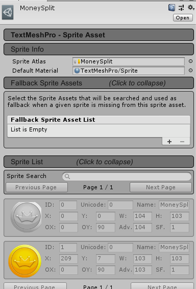
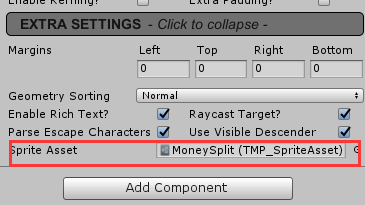
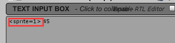

## 登录与注册

后端主要实现用户验证、用户注册、用户属性同步、重复登录提醒、在线人数统计等功能。

前端主要实现玩家属性加载、好友在线提醒等功能。

定义新消息PLAYER_ATTRIBUTE，传递玩家基本属性。

### 后端

首先在数据库新建数据表，在后端新建用于数据库处理的文件夹`DB`。

#### OnRecvLogin.cs

根据用户输入的账号和密码，到玩家表中找是否存在该玩家，返回结果。

同时，向前端发送`SPlayerEnter`消息，允许登录。

从数据库中加载角色属性。

#### OnRecvRegister.cs

实现用户注册逻辑，并与数据库进行对比，提醒用户创建成功或用户名已存在。

#### DB/

在这里实现与数据库交互的逻辑，定义SQL语句。

### 前端

在Player中，新增PlayerInfo类，保存玩家的基本属性。

收到后端`S_PLAYER_ATTRIBUTE`消息后，动态加载到前端UI进行显示。

## 聊天与历史记录

后端主要对前端的聊天消息进行转发和群发，并异步将聊天记录保存在消息队列中。

前端主要实现了单人聊天、群聊功能，好友在线消息提醒，未读消息缓存等功能。

在聊天消息同步上，使用线程池创建后台线程，每隔一段时间就将当前消息队列同步到数据库中。

### 后端

#### OnlinePlayers

在`OnRecvPlayerEnter`时保存玩家基本属性到`OnlinePlayers`字典中，并向所有玩家发送新在线玩家的属性，便于前端聊天页面的实时更新。

#### ChatHistorySync.cs

作为后台线程，在后台运行时同时运行，主要用于将后端接收到的聊天消息队列**批量**写入数据库中进行持久化。

为了实现聊天记录同步效率最高，本系统进行了如下优化：

1. 每隔一段时间，后台线程会检查当前消息队列是否有新消息，实现批量插入，最大限度的减少与数据库的通信开销。
2. 在SQL语句中，使用`StringBuilder`类而不是`String`类，这样可以避免修改字符串造成的新建字符串开销，此举在插入1w行数据时可以提高两倍的速度
3. 在SQL语句中，事先指定命令类型，避免动态加载。

### 前端

#### OnRecChatMessage.cs

实现接收到消息的逻辑，将聊天记录缓存在消息队列中，并提醒当前玩家有新消息。

#### FriendUI

接收新玩家登录消息，并实时更新在线玩家，展示在聊天框中。

#### ChatUI

实现从消息队列中读取其他玩家消息的逻辑，并将用户发出的消息向后端发送。

实现可获取和其他玩家的历史N条记录并显示在聊天框中。

### Reference

1. [Unity点击鼠标绑定事件](https://www.cnblogs.com/isayes/p/6370168.html)
2. [C#多线程实现](https://www.cnblogs.com/luxiaoxun/p/3280146.html)
3. [前台进程与后台进程区别](https://www.c-sharpcorner.com/UploadFile/ff0d0f/working-of-thread-and-foreground-background-thread-in-C-Sharp730/)

## 添加好友

- 搜索好友并添加
- 接收/拒绝好友请求
- 离线好友发送消息

### 后端

#### OnRecvCFriendRequest.cs

发送好友请求消息

#### OnRecvCFriends.cs

发送玩家好友消息

#### OnRecvAddFriend.cs

收到前端传来的玩家好友请求消息

- 若想要添加好友的玩家不存在，则向前端发送消息提示搜索玩家不存在

- 无论接受抑或拒绝，都需要在 `friendRequest` 中删除该条请求记录
- 若接受了好友请求，则在 `friends` 中增加记录

### 前端

#### AddFriendUI.cs

- 判断想要添加的玩家是否已经是好友，若是则提示已是好友消息
- 向后端发送添加好友请求，若玩家不存在，则后端会向前端发送消息，前端在界面中显示玩家不存在

#### SelfFriendUI.cs

- 显示已经添加的所有好友，可以查看离线好友之前发送的信息

## 市场与物品交易

### 后端

#### OnRecvLogin.cs

向前端发送商店及所有宝物属性信息，在后端维护了两个字典，`treasureAttributes` 存放所有宝物属性信息，`backMall` 存放商场中的宝物信息，当有新玩家登入时将这两个字典发送给前端，在第一个玩家进入时初始化，之后无需从数据库读，一直维护在内存中。

#### OnRecvBuy.cs

当收到前端消息`C_BUY`后，分别对购买的金币物品和银币物品进行操作

- 对于购买的银币物品，前端已经在购买后直接修改玩家银币值和背包，后端修改内存中玩家银币值，修改数据库中玩家的银币值和背包，同时增加一条交易记录
- 对于购买的金币物品，要保证数据的一致性，采用`事务`的方式处理每一个金币商品的购物请求，每个事务`GoldTransactionSQL`修改买家和卖家的金币数、从市场删去宝物、增加买家的背包、增加一条交易记录，最后向前端传输玩家购买后的剩余金币值和真正购买成功的金币宝物
- 对于金币物品，若卖家在线，则我们还会将该售卖信息传给卖家，修改他当前的金币值和商场
- 对于其他玩家，金币物品的出售不需要发送消息给他们，因为金币物品的购买一定是先在后端以`事务`的方式处理后，才会返回购买结果，并且他们会定期向后端请求最新的商场信息，因此已出售的金币物品也不会在其商场中停留太久

#### DB/

实现与数据库交互的逻辑，定义SQL语句与处理函数，如读取宝物信息、商场宝物信息、修改金币银币值、增删玩家背包等

### 前端

#### AttributeUI.cs

设计了展示物品属性的界面

#### ItemDetailUI.cs

根据用户点击的物品，动态从数据库中加载物品属性，并根据物品的购买类型（金币、银币），加载不同的动画。

同时，实现用户加入购物车或取消的过程。

#### CounterUI.cs

根据用户添加到购物车的物品，分别计算金币、银币物品的总价，并实现用户购买时向后端发送购买请求的逻辑。

由于银币可以丢失，因此直接将用户购买的银币物品加入背包，而金币需要等数据库修改之后再添加。

#### TextMash

在Unity中，提供了富文本类型，可以将图片嵌入文本进行显示（也可以任意设置文本的字体、大小）。

由于宝物在市场中的Layout固定，因此需要使用TextMash来添加金币、银币的标识，让用户知道这是金币购买还是银币购买。

参考资料：

1. [在Unity中将sprite分开为多个GameObject](http://www.unity.5helpyou.com/3625.html)

2. 将普通Sprite制作为Sprite Asset（作为TextMash中图片的来源）：
   - 右键需要制作的Sprite->Create->TextMashPro->Sprite Asset
   - 

3. 新建`TextMash --Text` 的GameObject，并添加Sprite Asset：

   - 

4. 在文本中使用对应的ID即可使用：

   - 

5. 在Script中使用该[GameObject](https://forum.unity.com/threads/from-unity-ui-to-textmeshpro.463619/)，需要添加NameSpace

## 背包与售卖佩戴

### 后端

#### OnRecvSellGold.cs

处理玩家出售金币商品，在内存中放入商场，并修改数据库，将商品从玩家背包中移除并放入商场，在此不需要将消息发送给其他玩家，因为所有玩家都会定期向后端请求最新的商场信息

#### OnRecvSellSilver.cs

处理玩家出售银币商品，在内存中修改玩家银币值，同时修改数据库中玩家的背包和银币值

#### OnRecvPlayerAttribute.cs

处理玩家穿脱宝物，先修改后端内存中玩家的各个属性值，再修改数据库中玩家的各个属性值

#### OnRecvTreasureWear.cs

处理玩家穿脱宝物，修改玩家背包中商品的穿脱属性

#### DB/

实现与数据库交互的逻辑，定义SQL语句与处理函数，如增删商场宝物、修改金币银币值、增删玩家背包、修改玩家佩戴宝物信息等

### 前端

主体是前端在unity中实现的一些界面

#### SellUI.cs

售卖物品

- 银币物品，则直接卖给商场，以商场的售价回收物品，并直接增加玩家的银币值并修改背包中的物品，发送消息给后端增加玩家的银币数量同时减去背包中出售的物品
- 金币物品，玩家设定价格，并放入商场，其他玩家需要等到后端收到消息并处理后才会在自己的商场中显示新的金币商品
- 在前端开了一个线程，每隔1分钟向后端请求当前商场的信息，从而确保玩家可以看到其他玩家新出售的商品

#### WearUI.cs

佩戴物品

- 每个物品都有自己的类型，玩家同一种类型的物品只能穿一件，否则会提醒先脱下同类型的物品
- 佩戴物品后直接在前端更新玩家的属性值，**为了减少通信代价，当玩家关闭属性界面时，才会将玩家穿脱的物品记录和现在的各个属性值一次性传给后端**

#### SelfSellUI.cs

展示出售物品

- 显示玩家出售的宝物，并且可以取消出售，放回背包

## 商品描述

### 普通物品

- 增加玩家的各种属性值、买卖

### 特殊物品

- 增加血液 AddHpUI.cs
  - 特定药水可以恢复一滴血，玩家服用便可增加一滴血

## 人物互动

### 回血

当碰撞到`HealthCrate`时，自动恢复满血

### 传送

- 游戏中有多个传送门，进入传送门时，传送到指定位置

### 陷阱

- 在游戏场景中，有一个感应用户压力的陷阱，当踩到触发按钮时，会有石块下落困住怪物

### 寻宝

- 在人物初始化地点周围，有一个宝物箱，靠近即可得到今日的宝物

### 小地图

- 多使用一个摄像机来显示玩家头顶的地图，并随着玩家行走和朝向进行变化
- 主要[参考这里](https://www.youtube.com/watch?v=28JTTXqMvOU)

### 其他

- 屏幕自适应