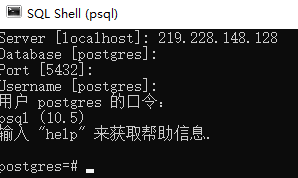

# Welcome

这个项目来源于Unity Asset Store上的[3d-game-kit](https://assetstore.unity.com/packages/essentials/tutorial-projects/3d-game-kit-115747)。主要变更是为其增加了个后端服务器，并实现多人同时在线游戏、聊天等功能，使它变成了一个网络游戏。

# How to Start

-  [安装Unity3d](https://store.unity.com/cn)

-  [安装Visual Studio](https://visualstudio.microsoft.com/)

-  [下载资源](https://share.weiyun.com/5nofemx)

  密码：wkwk6g

资源文件中包括字体，3D模型，图片，音乐等资源

## 目录结构

```
MMORPG
  |-- Backend                                            服务端
        |-- Backend.sln                                  服务端解决方案文件
        |-- Backend.csproj
        |-- ....
  |-- Frontend                                           客户端, Unity工程，可以用Unity Editor打开
        |-- Assets
            |-- 3DGamekit
                  |-- Art                                资源文件
                  |-- Scripts                            C#代码
                  |-- ....
            |-- BEAssets                                 从客户端导出的供后端使用的一些信息
            |-- ....
        |-- Library
        |-- obj                                          客户端解决方案文件
        |-- Packages
        |-- Frontend.sln                                 
        |-- Assembly-CSharp-Editor.csproj
        |-- Assembly-CSharp.csproj
        |-- NavMeshComponents.csproj
        |-- SimpleSFXRuntime.csproj
        |-- Skybox3DRuntime.csproj
        |-- WorldBuildingRuntime.csproj
        |-- ....
  |-- MMORPG.sln  
  |-- ....

```

## 解压资源

解压资源文件Art.zip到 *MMORPG\Frontend\Assets\3DGamekit* 目录下

## 使用Unity Editor导入项目

启动Unity Editor， PROJECT --> OPEN --> 选择项目目录MMORPG\Frontend  

Unity Editor会在MMORPG\Frontend文件夹下创建Library文件夹，存放依赖的库文件，也会重新导入资源文件

## 安装依赖库

Backend用到了[GeometRi](https://github.com/RiSearcher/GeometRi.CSharp)，一个用于空间计算的library。进入项目目录，在powershell中输入:

```
dotnet add backend package GeometRi --version 1.3.5.3
```


## 使用VS Build Backend

打开Visual Studio，build backend：


## 启动Backend

- 更改配置文件backend.conf，<assetPath>改成自己的配置
  （在MMORPG/Frontend/Assets/BEAssets下，这个文件夹存的是从客户端导出的一些信息, 例如： 每个场景的阻档点，精灵出生点坐标等）
- 打开MMORPG.sln,发布bakcend项目
  - 首先将setting指向自己的配置文件：
    - 
  - 然后Publish：
    - 
- 将backend设为启动项目：
  - 
- 在VS中启动Backend.exe，命令行参数为配置文件路径，如

```shell
 .\Backend.exe E:\\MMORPG\\Frontend\\Assets\\BEAssets\\backend.conf
```


## 使用Unity3d Editor执行, 或build成APP执行

- 选择场景：打开scene-level1/...
- 点击上方小三角，进入调试
- 点击左上角的File—>BuildSettings，进行build

## play

WASD移动  
左键点击进行攻击  
右键锁定视角  

# Backend

使用两台机器完成游戏后端的部署

1. `219.228.148.128`
   - 部署PostgreSQL
2. `219.228.148.237`
   - 后端暴露端口，供前端访问，实现多人同时在线，并广播消息

## Port

后端部署在局域网的一台机器上，需要在前端`\Frontend\Assets\BEAssets\backend.conf`指定端口号：

```xml
<?xml version="1.0" encoding="utf-8"?>
<BackendConf xmlns:xsi="http://www.w3.org/2001/XMLSchema-instance" xmlns:xsd="http://www.w3.org/2001/XMLSchema">
  <host>219.228.148.237</host>
  <port>7777</port>
  <asset_path>E:/MMORPG/Frontend/Assets/BEAssets</asset_path>
  <scenes>
    <string>Level1.asset</string>
  </scenes>
</BackendConf>
```

## DataBase

### 安装 `Npgsql` 

- 官方地址 https://www.nuget.org/packages/Npgsql/

- VS -> Tool -> NuGet Package Manager -> Package Manager Console

  - 输入 `Install-Package Npgsql -Version 4.0.3`
  - 安装完成会在 `Dependencies` 中出现

  

1. 在需要使用数据库的 C# 文件中使用 `using Npgsql;` 头文件即可。
2. 已在 `PostgreConnect` 中实现 `ConnectPostgresql` 访问数据库时直接调用即可。

使用postgreSQL作为数据库，且数据库在`219.228.148.128`的机器上

### 允许局域网访问

首先需要修改配置文件，允许局域网的机器访问。

首先需要找到这两个配置文件：

1. `pg_hba.conf `
   - Linux机器上很简单，`/etc/data`中
   - 但在Windows上，请[参考这里](https://stackoverflow.com/questions/4465475/where-is-the-postgresql-config-file-postgresql-conf-on-windows)进行设置
2. `postgresql.conf`
   - 在同样的目录下

然后根据[这篇博客](https://blog.csdn.net/shouzang/article/details/81262029)进行设置，确保局域网内其他电脑可以访问

最后需要在防火墙中增加规则，暴露端口号。

使用SQL shell测试：



现在就可以访问远程的数据库了


