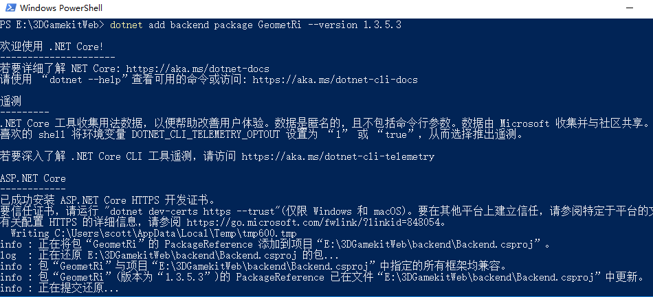
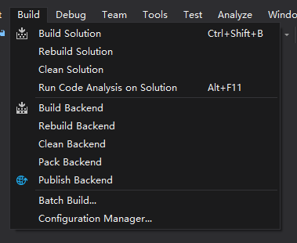
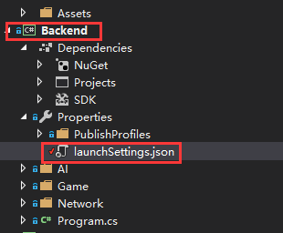
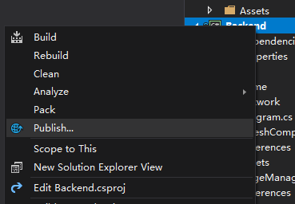
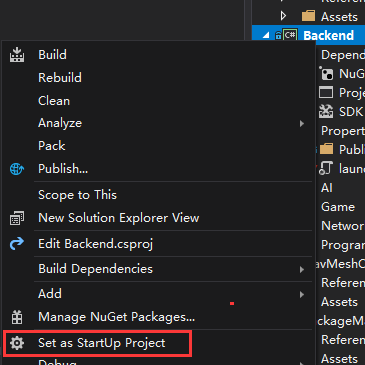
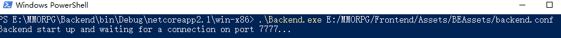

# Welcome

这个项目来源于Unity Asset Store上的[3d-game-kit](https://assetstore.unity.com/packages/essentials/tutorial-projects/3d-game-kit-115747)。主要变更是为其增加了个后端服务器，使它变成了一个网络游戏。

# How to Start

#### [安装Unity3d](https://store.unity.com/cn)

#### [安装Visual Studio](https://visualstudio.microsoft.com/)

#### [下载资源](https://share.weiyun.com/5nofemx)

密码：wkwk6g

资源文件中包括字体，3D模型，图片，音乐等资源

#### 目录结构
```
MMORPG
  |-- Backend                                            服务端
        |-- Backend.sln                                  服务端解决方案文件
        |-- Backend.csproj
        |-- ....
  |-- Frontend                                           客户端, Unity工程，可以用Unity Editor打开
        |-- Assets
            |-- 3DGamekit
                  |-- Art                                资源文件
                  |-- Scripts                            C#代码
                  |-- ....
            |-- BEAssets                                 从客户端导出的供后端使用的一些信息
            |-- ....
        |-- Library
        |-- obj                                          客户端解决方案文件
        |-- Packages
        |-- Frontend.sln                                 
        |-- Assembly-CSharp-Editor.csproj
        |-- Assembly-CSharp.csproj
        |-- NavMeshComponents.csproj
        |-- SimpleSFXRuntime.csproj
        |-- Skybox3DRuntime.csproj
        |-- WorldBuildingRuntime.csproj
        |-- ....
  |-- MMORPG.sln  
  |-- ....

```
#### 解压资源
解压资源文件Art.zip到 *MMORPG\Frontend\Assets\3DGamekit* 目录下


#### 使用Unity Editor导入项目

启动Unity Editor， PROJECT --> OPEN --> 选择项目目录MMORPG\Frontend  

Unity Editor会在MMORPG\Frontend文件夹下创建Library文件夹，存放依赖的库文件，也会重新导入资源文件

#### 安装依赖库

Backend用到了[GeometRi](https://github.com/RiSearcher/GeometRi.CSharp)，一个用于空间计算的library。进入项目目录，在powershell中输入:

```
dotnet add backend package GeometRi --version 1.3.5.3
```



#### 使用VS Build Backend

打开Visual Studio，build backend：



#### 启动Backend

- 更改配置文件backend.conf，<assetPath>改成自己的配置
（在MMORPG/Frontend/Assets/BEAssets下，这个文件夹存的是从客户端导出的一些信息, 例如： 每个场景的阻档点，精灵出生点坐标等）
- 打开MMORPG.sln,发布bakcend项目
  - 首先将setting指向自己的配置文件：
    - 
  - 然后Publish：
    - 
- 将backend设为启动项目：
  - 
- 在VS中启动Backend.exe，命令行参数为配置文件路径，如
```shell
 .\Backend.exe E:\\MMORPG\\Frontend\\Assets\\BEAssets\\backend.conf
```


#### 使用Unity3d Editor执行, 或build成APP执行
- 选择场景：打开scene-level1/...
- 点击上方小三角，进入调试
- 点击左上角的File—>BuildSettings，进行build

#### 输入
WASD移动  
左键点击进行攻击  
右键锁定视角  
